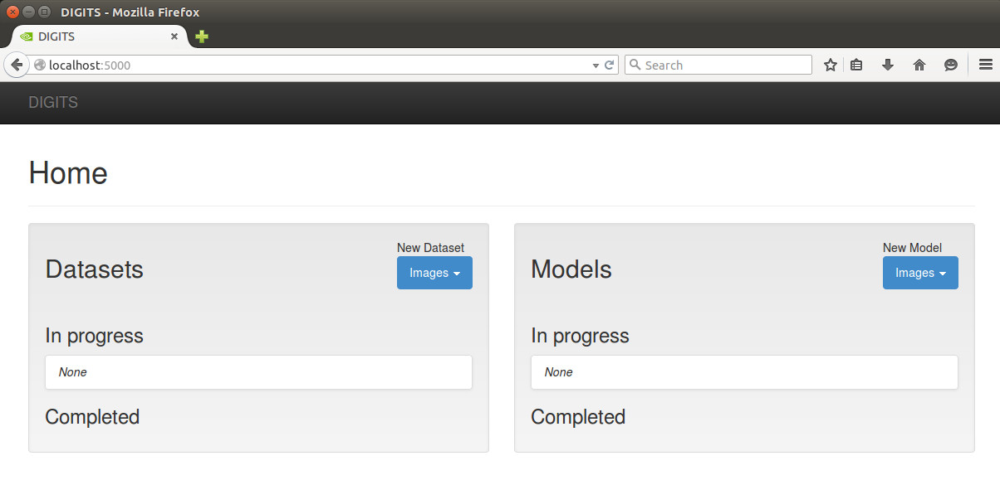
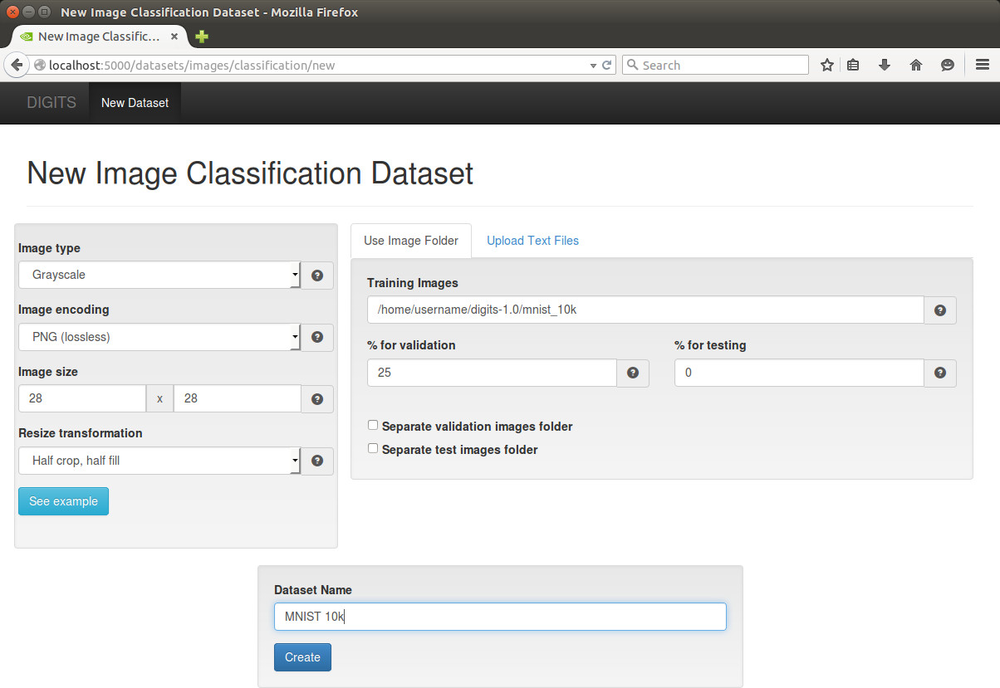
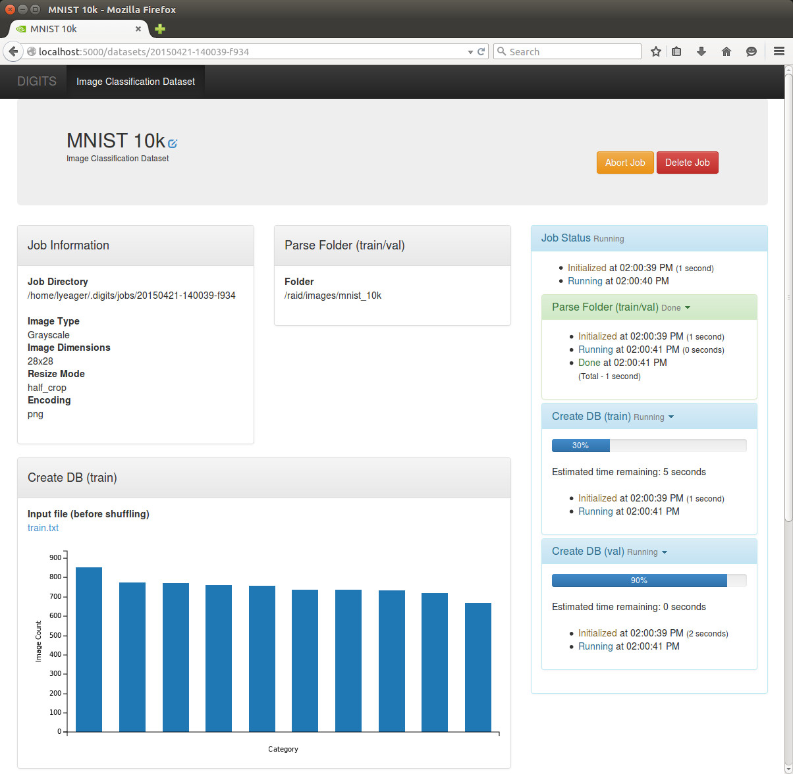
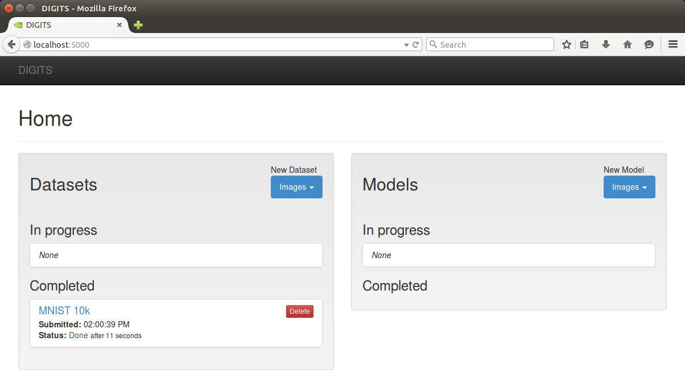
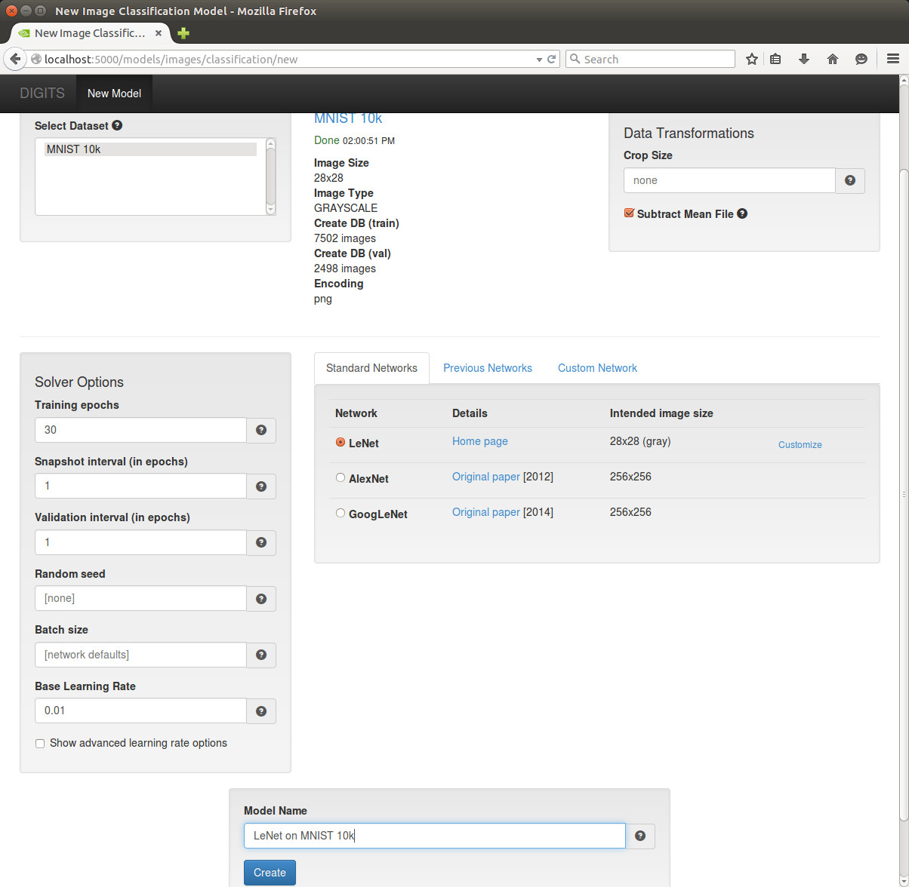
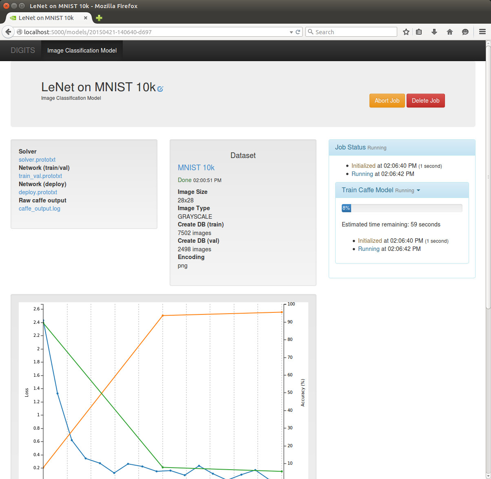
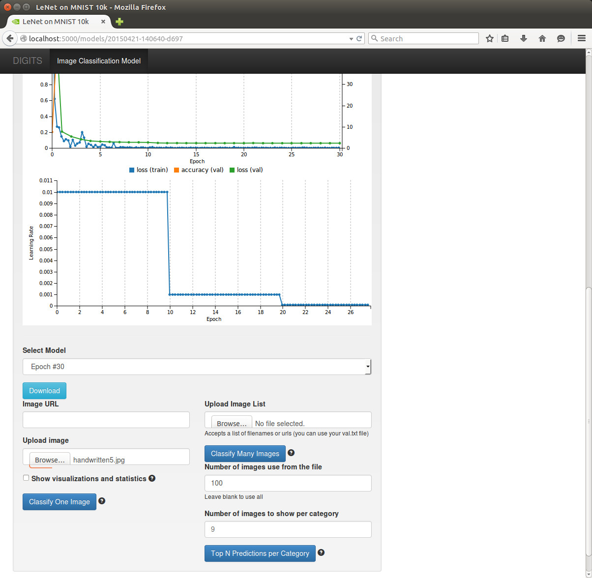
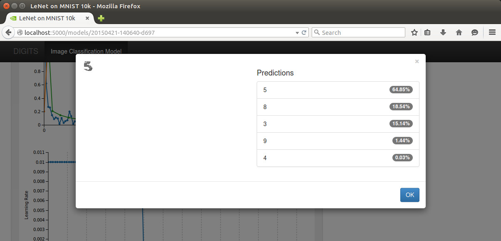

# Getting Started

Table of Contents
=================
* [Installation](#installation)
* [Starting the server](#starting-the-server)
* [Using the webapp](#using-the-webapp)
    * [Creating a Dataset](#creating-a-dataset)
    * [Training a Model](#training-a-model)
* [Using the REST API](#using-the-rest-api)

## Installation

If you are using the web installer, check out this [installation page](WebInstall.md).

If you are installing from source, check out the [README](../README.md#installation).

## Starting the server

If you are using the web installer use the `runme.sh` script:

    % cd $HOME/digits-2.0
    % ./runme.sh

If you are not using the web installer, use the `digits-devserver` script:

    % cd $HOME/digits
    % ./digits-devserver

The first time DIGITS is run, you may be asked to provide some configuration options.

```
% ./digits-devserver
  ___ ___ ___ ___ _____ ___
 |   \_ _/ __|_ _|_   _/ __|
 | |) | | (_ || |  | | \__ \
 |___/___\___|___| |_| |___/

DIGITS requires at least one DL backend to run.
==================================== Caffe =====================================
Where is caffe installed?

        Suggested values:
        (P*) [PATH/PYTHONPATH] <PATHS>
>> ~/caffe
Using "/home/username/caffe"

Saved config to /home/username/digits/digits/digits.cfg
 * Running on http://0.0.0.0:5000/
```

 Most values are set silently by default. If you need more control over your configuration, try one of these commands:

    # Set more options before starting the server
    ./digits-devserver --config
    # Advanced usage
    python -m digits.config.edit --verbose

## Using the Webapp

Now that DIGITS is running, open a browser and go to http://localhost:5000.  You should see the DIGITS home screen:



For the example in this document, we will be using the [MNIST handwritten digit database](http://yann.lecun.com/exdb/mnist) as our dataset and [LeNet-5](http://yann.lecun.com/exdb/lenet/) for our network. Both are generously made available by Yann LeCun on his [website](http://yann.lecun.com/).

If you are not using the web installer, you can use the script at `tools/download_data/main.py` to download the MNIST dataset. See [Standard Datasets](StandardDatasets.md) for details.

### Creating a Dataset

In the Datasets section on the left side of the page, click on the blue `Images` button and select `Classification` which will take you to the "New Image Classification Dataset" page.

* Change the image type to `Grayscale`
* Change the image size to 28 x 28
* Type in the path to the MNIST training images
  * `/home/username/digits-2.0/mnist/train` if you are using the web installer
* Give the dataset a name
* Click on the `Create` button



While the model creation job is running, you should see the expected completion time on the right side:



When the data set has completed training, go back to the home page, by clicking `DIGITS` in the top left hand part of the page.  You should now see that there is a trained data set.



### Training a Model

In the Models section on the left side of the page, click on the blue `Images` button and select `Classification` which will take you to the "New Image Classification Model" page.  For this example, do the following:
* Choose the MNIST dataset in the "Select Dataset" field
* Choose the `LeNet` network in the "Standard Networks" tab
* Give the model a name
* Click on the `Create` button



While training the model, you should see the expected completion time on the right side:



To test the model, scroll to the bottom of the page.  On the left side are tools for testing the model.
* Click on the `Upload Image` field which will bring up a local file browser and choose a file
  * If you've used the web installer, choose one in `/home/username/digits-2.0/mnist/test`
* Or, find an image on the web and paste the URL into the `Image URL` field
* Click on `Classify One Image`



DIGITS will display the top five classifications and corresponding confidence values.




## Using the REST API

Use your favorite tool (`curl`, `wget`, etc.) to interact with DIGITS through the [REST API](API.md).

    curl localhost:5000/index.json
